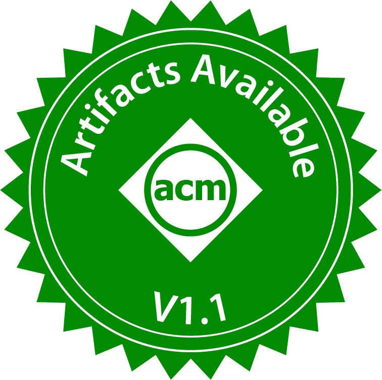

I'm a Ph.D. student at UPenn's [Distributed Systems Lab](https://dsl.cis.upenn.edu/) advised by [Vincent Liu](https://vincen.tl/). I'm broadly interested in networks and Machine Learning systems.

Before joining UPenn, I got my bachelor's degree in Computer Science and Operations Research at UC Berkeley, where I was part of the Sky Lab (formerly RISELab). I was advised by [Joseph Gonzalez](http://people.eecs.berkeley.edu/~jegonzal/) and [Paras Jain](https://www.parasjain.com/) at the Sky Lab and [Rakesh Verma](http://cs.uh.edu/~rmverma/) at UH.

Check out my CV [here](https://drive.google.com/file/d/1jSAHMol5t-h_BSJtyR8Xh-U2pe0HEETm/view?usp=sharing)!

## Recent Publication
1. *𝝀-trim: Optimizing Function Initialization in Serverless Applications With Cost-driven Debloating.*
**Xuting Liu**\*, Spyros Pavlatos\*, Yuhao Liu, Vincent Liu (\* Equal contribution).
ASPLOS 25.  (To be presented in ASPLOS 26)

   [[Link]](https://doi.org/10.1145/3676642.3736129)  [[Code]](https://github.com/xutingl/lambda-trim-artifact)

2. *Rethinking Machine Learning Collective Communication as a Multi-Commodity Flow Problem.*
**Xuting Liu**, Behnaz Arzani, Siva Kesava Reddy Kakarla, Liangyu Zhao, Vincent Liu, Miguel Castro, Srikanth Kandula, Luke Marshall.
SIGCOMM 24.

   [[Link]](https://doi.org/10.1145/3651890.3672249)  [[Code]](https://github.com/microsoft/TE-CCL)

    Artifact available  Artifact functional

## Recent Work Experience
### Microsoft Research Asia, Beijing
_07/2024 - 10/2024_

Distributed ML Systems

Mentor: [Jilong Xue](https://www.microsoft.com/en-us/research/people/jxue/)

### Microsoft Research, Redmond
_12/2023 - 12/2024_

GPU collective communication

Mentors: [Behnaz Arzani](https://www.microsoft.com/en-us/research/people/bearzani/) and [Siva Kesava Reddy Kakarla](https://www.sivak.dev/)
